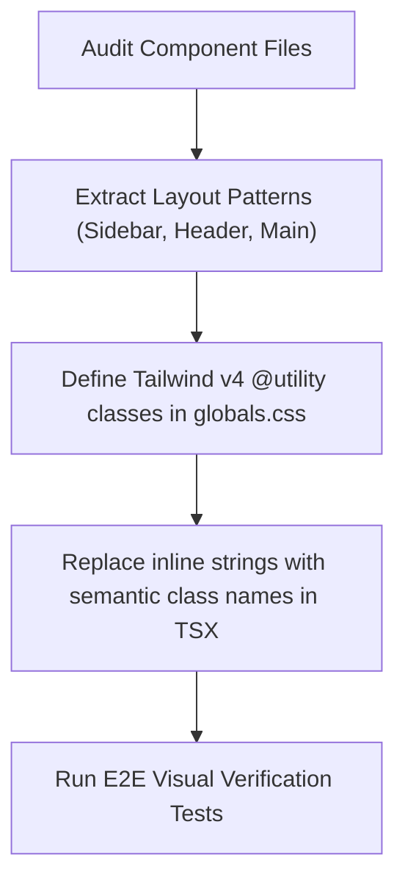

# CSS Architecture & Design System Best Practices Plan

This document outlines a structural refactoring plan to address class repetition, layout property collisions, and design system consistency in the Hearth Command frontend.

---

## 1. Identified Issues & Diagnostics

### A. Utility Collision & Redundancy
Elements often contain multiple layout constraints that conflict or repeat properties. For example:
```html
<aside class="flex flex-col h-full ... h-screen ...">
```
* **Conflict**: `h-full` (`height: 100%`) instructs the element to match the height of its direct parent, whereas `h-screen` (`height: 100vh`) forces it to match the browser viewport height. On a `fixed` container, both are parsed but only one takes effect.
* **Redundancy**: `bg-surface-container dark:bg-surface-container` and `border-outline-variant dark:border-outline-variant`. Since Hearth Command is a dark-themed application, the dark variants point to the exact same colors. Repeating them line-by-line bloats the DOM.

### B. "Strap-on Line-by-Line" Design System
Rather than drawing from semantic layout blocks, styles are applied inline on every tag. This causes:
* **Brittle Code**: Changing the spacing, font size, or rounded corners of a card requires updating dozens of utility string occurrences across multiple component files.
* **Layout Inconsistencies**: Ad-hoc deviations in padding (`p-md`, `p-sm`, `p-4`) or colors make the visual rhythm less cohesive.

---

## 2. Refactoring Strategy

We will leverage **Tailwind v4's native styling features** combined with **standard CSS design system tiers** to clean up the code.

### A. Semantic Theme Classes (Tailwind v4 `@utility` / `@layer`)
Instead of duplicating long strings of layout utilities inside JSX code, we will consolidate common layout elements into semantic classes inside `globals.css` using Tailwind v4's directive features.

#### Example Refactoring: The Sidebar Layout
Instead of this in `Sidebar.tsx`:
```tsx
<aside className="flex flex-col py-md bg-surface-container h-screen w-64 fixed left-0 top-0 border-r border-outline-variant z-50">
```

We will define a semantic class inside [globals.css](file:///Users/tobinelavathil/dev/fireboard-pitmaster/frontend/src/app/globals.css):
```css
@utility dashboard-sidebar {
  display: flex;
  flex-direction: column;
  padding-block: var(--spacing-sm);
  background-color: var(--color-surface-container);
  height: 100vh;
  width: 16rem; /* w-64 */
  position: fixed;
  inset-block-start: 0;
  inset-inline-start: 0;
  border-inline-end: 1px solid var(--color-outline-variant);
  z-index: 50;
}
```
*Note: Using logical properties like `inset-inline-start` and `border-inline-end` ensures layout flexibility across different localization writing directions.*

And the React component becomes clean and readable:
```tsx
<aside className="dashboard-sidebar">
```

### B. Centralize Interactive Hover States & Transitions
Hover transitions and active states can be centralized to prevent copy-pasting active borders and scale effects:
```css
@utility nav-item {
  display: flex;
  align-items: center;
  gap: var(--spacing-xs);
  padding: var(--spacing-xs) var(--spacing-sm);
  cursor: pointer;
  color: var(--color-on-surface-variant);
  transition: background-color 0.2s, color 0.2s;
  
  &:hover {
    background-color: var(--color-surface-container-high);
    color: var(--color-on-surface);
  }
  
  &.active {
    background-color: var(--color-primary-container);
    color: var(--color-on-primary-container);
    font-weight: 700;
    border-inline-start: 4px solid var(--color-primary);
  }
}
```

---

## 3. Concrete Action Items



1. **Step 1**: Clean up all redundant duplicate tags like `dark:` variants and conflicting height modifiers.
2. **Step 2**: Extract structural components (Sidebar, Header, Card surface containers) into `@utility` classes in `globals.css`.
3. **Step 3**: Re-run Next.js E2E screenshots to confirm there are zero visual regressions.
