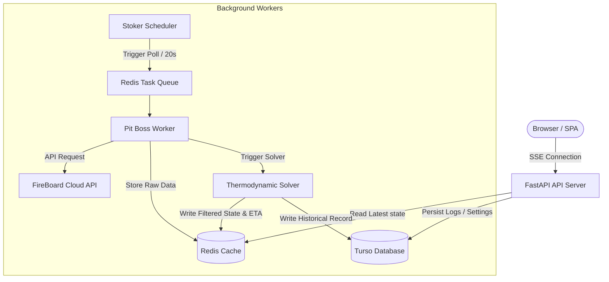

# Technical Specification: Sprint 1 (Ingestion & Storage)

This document serves as the agreed-upon technical specification for **Sprint 1 (Ingestion & Storage)** of the FireBoard Pitmaster application. Subsequent sprints (Filtering, Solver Integration, and UI Dashboard) will be specified and planned in later phases.

---

## 1. Architectural Summary (Sprint 1)



* **Frontend**: Next.js SPA (React, TailwindCSS, Tremor/D3.js).
* **Backend**: FastAPI (Python 3.11+) handles REST endpoints, authentication caching, and SSE streams.
* **Database**: **Turso (SQLite via `libsql`)** stores user credentials, device configurations, active session metadata, and historical cook profiles.
* **Broker & Cache**: **Redis** stores active cook sessions, short-term time series (last 30 minutes of telemetry), and queues background tasks.
* **Background Processing**:
  * **Stoker (Scheduler)**: Triggers a poll task strictly every 20 seconds.
  * **Pit Boss (Worker)**: Polls the FireBoard API, applies the Kalman Filter, executes the 1D Crank-Nicolson solver, and writes results to Redis and Turso.
* **Client Streaming**: FastAPI reads the latest calculation states from Redis and streams them to the user via **Server-Sent Events (SSE)**.

---

## 2. Directory Structure

```text
fireboard-pitmaster/
├── docker-compose.yml           # Runs Redis, Pit Boss, Stoker, Backend, Frontend locally
├── .env.example                 # Template for environment variables (Turso URL/Token, FireBoard API)
├── README.md                    # Project overview
├── backend/
│   ├── Dockerfile
│   ├── requirements.txt         # FastAPI, Celery, redis, libsql-experimental, numpy, scipy, filterpy
│   └── app/
│       ├── __init__.py
│       ├── main.py              # FastAPI server, endpoints, SSE routers
│       ├── config.py            # Configuration loader
│       ├── database.py          # Turso (libsql) client and models (SQLAlchemy or SQLModel)
│       ├── cache.py             # Redis client and schema helpers
│       ├── pit_tasks.py         # Ingestion and prediction tasks (poller and solver triggers)
│       ├── math_engine/
│       │   ├── __init__.py
│       │   ├── kalman.py        # 1D Kalman filter to smooth raw temperature telemetry
│       │   └── solver.py        # 1D Crank-Nicolson heat equation solver and stall/carryover logic
│       └── schemas.py           # Pydantic schemas (Request/Response validation)
└── frontend/
    ├── Dockerfile
    ├── package.json
    ├── tailwind.config.js
    └── src/
        ├── app/
        │   ├── page.tsx         # Dashboard UI layout
        │   └── layout.tsx
        └── components/
            ├── LoginForm.tsx    # Session-wide FireBoard login
            ├── ProbeSettings.tsx# Set meat type, cut, weight, thickness, target temp, and channel mapping
            ├── TimerDisplay.tsx # Ring timer displaying remaining time
            └── TempChart.tsx    # Live charts tracking raw, filtered, and predicted trajectory
```

---

## 3. Database Schema (Turso)

Turso holds our long-term configurations and historical logs.

### `cook_sessions`
Stores metadata about each cook session.
* `id`: TEXT (UUID, Primary Key)
* `user_id`: TEXT
* `device_name`: TEXT
* `device_id`: TEXT
* `meat_type`: TEXT (Beef, Pork, Poultry, Lamb, Fish)
* `cut_type`: TEXT (e.g., Brisket, Pork Butt, Ribeye)
* `cooker_type`: TEXT (e.g., Kamado, Pellet Smoker, Oven)
* `status`: TEXT (Bare, Wrapped)
* `weight_kg`: REAL
* `thickness_mm`: REAL
* `target_temp_c`: REAL
* `created_at`: TIMESTAMP

### `telemetry_logs`
Stores the downsampled historical trajectory of the cook for charting.
* `id`: INTEGER (Primary Key AutoIncrement)
* `session_id`: TEXT (Foreign Key -> `cook_sessions.id`)
* `timestamp`: TIMESTAMP
* `core_temp_raw`: REAL
* `core_temp_filtered`: REAL
* `ambient_temp`: REAL
* `eta_seconds`: INTEGER

---

## 4. Rate Limiting & Error Handling Strategy

### Rate Limiting
* FireBoard rate limit: **17 calls per 5 minutes**.
* **Poller Mechanism**: The **Stoker** scheduler triggers `poll_fireboard_api` every **20 seconds** (15 calls per 5 minutes), staying safely within boundaries.
* If a request receives an HTTP 429:
  * The Poller pauses execution.
  * Backend logs the error to stderr.
  * Re-polling is delayed dynamically by 60 seconds.
  * SSE connection updates the client UI with a "Rate limit throttled - Retrying in 60s" warning.

### Error Handling
* **API Outages / Network Faults**: The poller catches connection errors, keeps retrying on schedule, and flags the session state in Redis as `stale`. The UI visually alerts the user when telemetry hasn't updated in >60 seconds.
* **Credentials/Token Expiration**: If the login session expires (HTTP 401), the poller attempts a single automated re-authentication. If that fails, it flags the session as `unauthenticated`, requiring the user to re-enter credentials in the UI.

---

## 5. Next Steps & Phase Sign-Off

To begin execution, we must agree on this Sprint 1 technical specification. 

Once approved, we will:
1. Initialize the **Backend folder structure** and set up the Python dependencies (`requirements.txt`).
2. Write the **Turso database schemas** and configuration loader.
3. Construct the **API Poller and Redis cache pipelines** inside the **Stoker** and **Pit Boss** background workers.
4. Establish the **FastAPI endpoints** to handle session creation, channel mapping, and user login credentials.

---

## 6. Future Roadmap

The following sprints are out of scope for this current technical specification and will be brainstormed, planned, and specified in future phases:

* **Sprint 2: Filtering & Estimation**: Implementation of the digital 1D Kalman Filter to smooth raw stepped data and compute noise-free rate-of-change ($dT/dt$).
* **Sprint 3: Predictive Solver Integration**: Implementation of the 1D Crank-Nicolson finite-difference thermodynamic solver, evaporative stall modeling (wrapped vs. bare), and statistical carryover/resting estimates.
* **Sprint 4: UI Dashboard & Real-Time Streaming**: Building the Next.js React frontend dashboard, Tremor/D3 graphs, SSE connection, and browser-side alerts.

