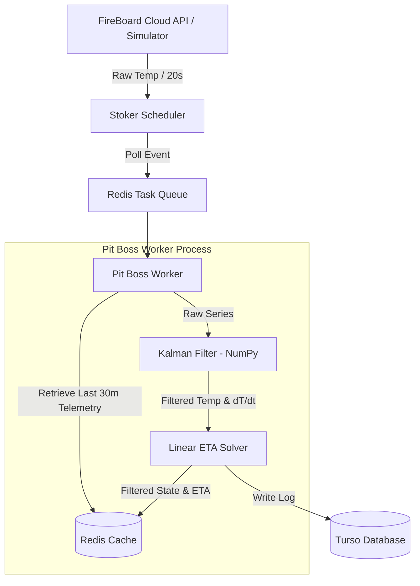

# Technical Specification: Sprint 2 (Filtering & Estimation)

This document serves as the agreed-upon technical specification for **Sprint 2 (Filtering & Estimation)** of the FireBoard Pitmaster application.

---

## 1. Architectural Summary (Sprint 2)

During Sprint 2, we introduce the **Math Engine** layer inside the background processing stack.



---

## 2. Directory Layout Additions

Sprint 2 introduces the `app/math_engine/` module:

```text
backend/app/
└── math_engine/
    ├── __init__.py
    └── kalman.py        # Custom 1D Kalman Filter using NumPy
```

---

## 3. Kalman Filter API Design

The module `app/math_engine/kalman.py` will expose a single class `CookingKalmanFilter`:

```python
import numpy as np

class CookingKalmanFilter:
    def __init__(self, R: float = 0.5, Q_temp: float = 0.001, Q_rate: float = 0.0001):
        """
        Initializes the state and noise covariance matrices.
        """
        # State vector [T, dT_dt]^T
        self.x = np.zeros((2, 1))
        
        # State Covariance matrix
        self.P = np.eye(2) * 10.0
        
        # Measurement matrix (we only measure temperature)
        self.H = np.array([[1.0, 0.0]])
        
        # Measurement noise covariance
        self.R = np.array([[R]])
        
        # Process noise covariance
        self.Q = np.array([
            [Q_temp, 0.0],
            [0.0, Q_rate]
        ])
        
        self.initialized = False

    def update(self, measurement: float, dt: float) -> tuple[float, float]:
        """
        Runs a single predict-update step of the Kalman Filter.
        Returns:
            (filtered_temperature, rate_of_change_c_per_second)
        """
```

---

## 4. Integration Pipeline

1. **State Restoration**: Since Celery workers are stateless and run tasks independently, the filter state ($x$ and $P$) cannot be held in memory. Instead, when a new measurement arrives:
   * The `pit_boss` retrieves the last 30 minutes of raw telemetry from the Redis sorted set (`telemetry:history:{device_id}:{channel_id}`).
   * The worker instantiates a new `CookingKalmanFilter` object.
   * It replays the raw telemetry points in chronological order through the filter to reconstruct the current optimal estimate of the state vector.
2. **Task Execution (`app/pit_tasks.py`)**:
   * Instead of the direct raw data pass-through, `run_predictions` will run the chronological history through the filter.
   * It retrieves the estimated core temperature ($T$) and the heating rate ($\dot{T}$).
   * The heating rate $\dot{T}$ (originally in °C/second) is scaled to °C/minute for logging and UI display.
   * The linear ETA is calculated as:
     $$\text{ETA (seconds)} = \frac{T_{\text{target}} - T_{\text{filtered}}}{\dot{T}_{\text{filtered}}}$$

---

## 5. Phase Sign-Off & Next Steps

Once this specification is approved, we will:
1. Implement `backend/app/math_engine/kalman.py`.
2. Connect it to the `run_predictions` task inside `backend/app/pit_tasks.py`.
3. Add a dedicated test file `backend/tests/test_kalman.py` containing simulated noisy step data and assert that the Kalman Filter outputs are smooth and differentiable.
4. Verify by running `make test`.
