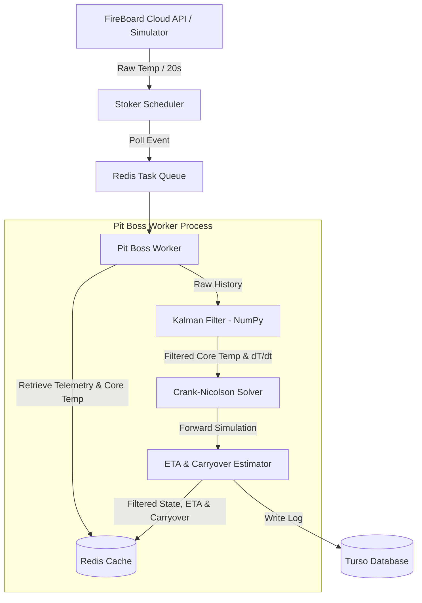

# Technical Specification: Sprint 3 (Thermodynamic Solver)

This document serves as the agreed-upon technical specification for **Sprint 3 (Thermodynamic Solver)** of the FireBoard Pitmaster application.

---

## 1. Architectural Summary (Sprint 3)

During Sprint 3, we implement the physical simulation engine inside the background processing stack. The linear ETA stub in `run_predictions` is replaced with a forward-simulating 1D Crank-Nicolson solver.



---

## 2. Directory Layout Additions

Sprint 3 introduces `solver.py` inside `app/math_engine/`:

```text
backend/app/
└── math_engine/
    ├── __init__.py
    ├── kalman.py
    └── solver.py        # 1D Crank-Nicolson Solver & Carryover Predictor
```

---

## 3. Mathematical Formulation (Crank-Nicolson)

We model the meat as a homogeneous 1D plate of thickness $2L$ (where $L = \text{thickness} / 2$ representing heat penetration from both sides). We discretize the domain $[0, L]$ into $N$ intervals ($N+1$ nodes) where $x = 0$ is the core (center of the meat) and $x = L$ is the surface.

The governing transient heat equation is:
$$\frac{\partial T}{\partial t} = D \frac{\partial^2 T}{\partial x^2}$$

Using the Crank-Nicolson method, the discretization at internal nodes $i = 1, \dots, N-1$ is:
$$\frac{T_i^{n+1} - T_i^n}{\Delta t} = \frac{D}{2 \Delta x^2} \left[ (T_{i-1}^n - 2T_i^n + T_{i+1}^n) + (T_{i-1}^{n+1} - 2T_i^{n+1} + T_{i+1}^{n+1}) \right]$$

Defining the Fourier parameter $\sigma = \frac{D \Delta t}{2 \Delta x^2}$:
$$-\sigma T_{i-1}^{n+1} + (1 + 2\sigma) T_i^{n+1} - \sigma T_{i+1}^{n+1} = \sigma T_{i-1}^n + (1 - 2\sigma) T_i^n + \sigma T_{i+1}^n$$

### 3.1 Core Boundary Condition (Symmetry at $x = 0$)
Using central difference for symmetry $\frac{\partial T}{\partial x} = 0 \implies T_{-1} = T_1$:
$$(1 + 2\sigma) T_0^{n+1} - 2\sigma T_1^{n+1} = (1 - 2\sigma) T_0^n + 2\sigma T_1^n$$

### 3.2 Convective Surface Boundary Condition ($x = L$)
The surface boundary is exposed to ambient temperature $T_{\text{ambient}}$:
$$-k \frac{\partial T}{\partial x} = h (T_N - T_{\text{ambient}})$$

Using a virtual node $T_{N+1}$ and Biot parameter $\gamma = \frac{h \Delta x}{k}$:
$$-2\sigma T_{N-1}^{n+1} + (1 + 2\sigma(1+\gamma)) T_N^{n+1} = 2\sigma T_{N-1}^n + (1 - 2\sigma(1+\gamma)) T_N^n + 2\sigma\gamma (T_{\text{ambient}}^n + T_{\text{ambient}}^{n+1})$$

This system forms a tridiagonal system $\mathbf{A} \underline{T}^{n+1} = \mathbf{B} \underline{T}^n + \underline{C}$ which is solved at each step using the Thomas algorithm (tridiagonal solver).

---

## 4. Stall & Carryover Modeling

### 4.1 Evaporative Stall
Barbecue stall is caused by surface water evaporation pinning the surface temperature near $T_{\text{stall}} \approx 70^\circ\text{C}$ (wet-bulb temperature).
1. **Stall Phase**: If the cooker is run low-and-slow, the surface node temperature is capped:
   $$T_N^{n+1} = \min(T_N^{n+1}, T_{\text{stall}})$$
2. **Moisture Depletion**: We define a total "stall duration" budget (in seconds) based on meat thickness, weight, and cooker type:
   $$t_{\text{stall}} = \alpha \cdot \text{thickness\_mm} \cdot \text{weight\_kg} \cdot \beta_{\text{cooker}}$$
   Where $\alpha \approx 12.0$ and $\beta_{\text{cooker}}$ adjusts for humidity/airflow (e.g. Kamado = 1.2, Pellet = 1.0).
3. **Transition**: Once the accumulated stall time exceeds $t_{\text{stall}}$, the surface is considered dry (bark forms) and the temperature cap is removed.

### 4.2 Carryover Resting
After removal from the cooker, heat continues to diffuse from the hot outer layers to the cooler core.
* **Resting Simulation**: Once the core temperature reaches $T_{\text{target}} - \Delta T_{\text{carryover}}$, we run a secondary simulation where $T_{\text{ambient}} = 20^\circ\text{C}$ (room temp) and convective coefficient $h$ is reduced (e.g., $h_{\text{rest}} = 5.0$).
* **Carryover Estimate**: The solver tracks the maximum core temperature reached during this resting phase. The carryover rise is calculated as:
  $$\Delta T_{\text{carryover}} = T_{\text{core, max}} - T_{\text{core, removal}}$$

---

## 5. Solver API Design

The module `app/math_engine/solver.py` will expose `CookingSolver`:

```python
class CookingSolver:
    def __init__(
        self,
        thickness_mm: float,
        weight_kg: float,
        cooker_type: str,
        target_temp_c: float,
        D: float = 0.14,  # Thermal diffusivity (mm^2/s)
        k: float = 0.5,   # Thermal conductivity (W/m*K)
        h: float = 15.0,  # Heat transfer coefficient (W/m^2*K)
    ):
        self.L = thickness_mm / 2.0
        self.weight_kg = weight_kg
        self.cooker_type = cooker_type
        self.target_temp_c = target_temp_c
        self.D = D
        self.k = k
        self.h = h
        
        # Grid parameters
        self.N = 10  # 10 spatial slices
        self.dx = self.L / self.N
        self.dt = 10.0  # 10s simulation steps

    def initialize_profile(self, current_core: float, current_ambient: float) -> np.ndarray:
        """
        Initializes a parabolic temperature profile from core to surface.
        """
        pass

    def simulate_cook(self, initial_core: float, ambient_temp: float) -> tuple[int, float]:
        """
        Simulates the cook forward in time until the core reaches target_temp_c.
        Returns:
            (eta_seconds, carryover_rise_c)
        """
        pass
```

---

## 6. Phase Sign-Off & Next Steps

Once this specification is approved, we will:
1. Implement `backend/app/math_engine/solver.py` with NumPy matrix calculations.
2. Connect it to `run_predictions` inside `backend/app/pit_tasks.py` to replace the linear stub.
3. Write unit tests in `backend/tests/test_solver.py` verifying Crank-Nicolson stability and carryover predictions.
4. Run `make test` to ensure the entire suite passes.
