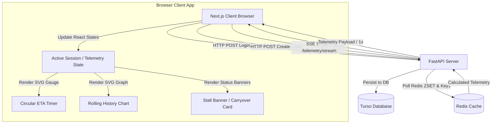

# Technical Specification: Sprint 4 (UI Dashboard & Streaming)

This document serves as the agreed-upon technical specification for **Sprint 4 (UI Dashboard & Streaming)** of the FireBoard Pitmaster application.

---

## 1. Architectural Summary (Sprint 4)

During Sprint 4, we build the Next.js frontend client to visualize live temperature data, Crank-Nicolson thermodynamic ETA predictions, and carryover estimates. The client establishes a persistent connection to the FastAPI backend via Server-Sent Events (SSE).



---

## 2. Directory Layout Additions

Sprint 4 introduces the Next.js App Router workspace inside the `frontend/` directory:

```text
frontend/
├── Dockerfile              # Optimized multi-stage runner
├── next.config.ts          # Configured for standalone build output
├── package.json            # React 19 / Next.js 16 / Tailwind v4 dependencies
└── src/app/
    ├── layout.tsx          # Font loaders (Outfit/Inter) & global layout HTML
    ├── globals.css         # Tailwind v4 directives and Google Stitch theme tokens
    └── page.tsx            # Main dashboard component with SSE listener
```

---

## 3. SSE Telemetry Stream Data Flow

The frontend establishes a connection using the browser's native `EventSource` API targeting the endpoint:
`http://localhost:8000/api/telemetry/stream/{device_id}/{channel_id}`

### 3.1 Connection Lifecycle
1. **Instantiation**: Connected when an `activeSession` state is populated.
2. **Buffer Stream**: Receives JSON telemetry payloads every 1 second containing:
   - `core_temp_raw`: The raw meat probe temperature.
   - `core_temp_filtered`: The Kalman-filtered smoothed temperature.
   - `ambient_temp`: The cooker ambient temperature.
   - `heating_rate`: Differentiable rate of change ($dT/dt$).
   - `stall_detected`: Boolean flag indicating evaporative plateau.
   - `eta_seconds`: Crank-Nicolson forward-simulated cook duration remaining.
   - `carryover_rise`: Crank-Nicolson simulated resting carryover.
   - `confidence`: Solver state confidence metric (`low`, `high`, `complete`).
3. **State Updates**: Updates the `telemetry` payload state to trigger reactive UI updates.
4. **History Array**: Appends points to a `history` array, maintaining a rolling list of the last 30 unique records (approx. 10 minutes of telemetry) for charting.

---

## 4. Visual Design System (Google Stitch Integration)

To deliver a premium, dark-mode user experience, we mapped typography and colors directly from the Google Stitch design layout (`Project 13322585525650987359`).

### 4.1 Custom Theme Tokens (Tailwind v4 `@theme`)
To ensure correct layout scale, custom font sizes and families are declared inside the CSS `@theme` directive in `globals.css`:
```css
@theme {
  /* Color system */
  --color-primary: #ffc688;
  --color-secondary: #47e266;
  --color-surface: #131314;
  --color-background: #0F0F10;

  /* Custom Font Families */
  --font-headline-md: var(--font-outfit);
  --font-display-temp: var(--font-outfit);
  --font-body-md: var(--font-inter);
  --font-label-sm: var(--font-inter);

  /* Custom Font Sizes */
  --font-size-headline-md: 20px;
  --font-size-display-temp: 80px;
  --font-size-label-sm: 12px;
  --font-size-headline-lg: 32px;
}
```

### 4.2 Layout Sizing and Grid Alignment
* **Circular ETA Gauge**: A `w-80 h-80` absolute-centered container containing a `viewBox="0 0 200 200"` SVG progress circle. The internal remaining time text is styled with `text-display-temp` (80px) and `text-glow-amber`.
* **Telemetry Cards Grid**: Arranged in a three-column layout (`grid-cols-1 md:grid-cols-3 gap-6`), displaying core, ambient, and rate trends using `text-4xl` (36px) numbers.
* **Rolling Graph**: A responsive SVG chart using custom path rendering of dynamic points relative to coordinate bounds.
* **Responsive Breakpoints**: Columns transition from a single-column layout on mobile devices to a 12-column grid (`lg:grid-cols-12`) on widescreen layouts (gauge = `lg:col-span-7`, details = `lg:col-span-5`).

---

## 5. Deployment & Configuration

### 5.1 Container Port Mapping
To prevent port conflicts with local running services (e.g., standard services running on port `3000`), the frontend container exposes port `3000` but is mapped to host port **`3001`**:
```yaml
  frontend:
    build:
      context: ./frontend
      dockerfile: Dockerfile
    ports:
      - "3001:3000"
    environment:
      - NEXT_PUBLIC_BACKEND_URL=http://localhost:8000
```

### 5.2 Standalone Build Target
The Next.js configuration is set to generate standalone outputs in `next.config.ts`:
```typescript
const nextConfig: NextConfig = {
  output: "standalone",
};
```
This enables the multi-stage `Dockerfile` to copy only the compiled static and runner files, keeping the final runner container extremely lightweight.
